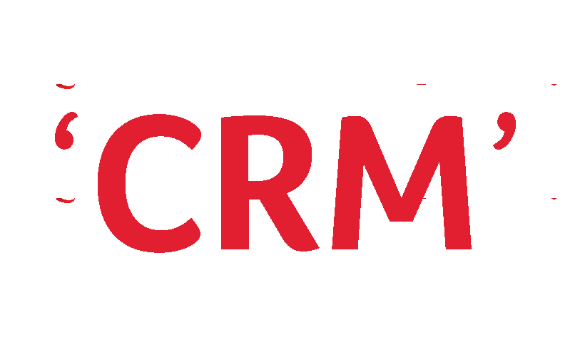

📊 Customer Relationship Management (CRM) Analysis
==================================================




📌 Overview
-----------

This project provides SQL-based CRM analytics using PostgreSQL. The dataset contains transactional data, including invoices, customer IDs, product details, and timestamps. Key metrics analyzed include Customer Lifetime Value (LTV), RFM segmentation, Customer Retention Rate, and Churn Rate.


## 🗂️ Table of Contents
- [📌 Overview](#-overview)
- [🗂️ Table of Contents](#-table-of-contents)
- [1️⃣ Data Preparation](#1️⃣-data-preparation)
  - [📌 Create Table](#-create-table)
  - [📌 Load Data](#-load-data)
  - [📌 Data Cleaning](#-data-cleaning)
  - [📌 Indexing for Faster Queries](#-indexing-for-faster-queries)
- [2️⃣ CRM Analysis](#2️⃣-crm-analysis)
  - [2.1 Total Spending by Each Customer](#21-total-spending-by-each-customer)
  - [2.2 RFM Analysis (Customer Segmentation)](#22-rfm-analysis-customer-segmentation)
  - [2.3 Top 10 Highest-Spending Customers](#23-top-10-highest-spending-customers)
  - [2.4 Customer Retention Rate](#24-customer-retention-rate)
  - [2.5 Customer Lifetime Value (LTV)](#25-customer-lifetime-value-ltv)
  - [2.6 Customer Churn Rate](#26-customer-churn-rate)
  - [2.7 Average Revenue Per User (ARPU)](#27-average-revenue-per-user-arpu)
  - [2.8 Repeat Purchase Rate (Customer Loyalty)](#28-repeat-purchase-rate-customer-loyalty)
- [**Authors**](#authors)

---


1️⃣ Data Preparation
--------------------

### 📌 Create Table

    CREATE TABLE online_retail(
        Invoice VARCHAR(20),
        StockCode VARCHAR(20),
        Description TEXT,
        Quantity INT,
        InvoiceDate TIMESTAMP,
        Price DECIMAL(10,2),
        CustomerID INT,
        Country VARCHAR(50)
    );
    

### 📌 Load Data

    COPY online_retail(Invoice, StockCode, Description, Quantity, InvoiceDate, Price, CustomerID, Country)
    FROM 'C:/Drive(D)/CRM_online_retail/online_retail_cleaned.csv'
    DELIMITER ','
    CSV HEADER;
    

### 📌 Data Cleaning

    DELETE FROM online_retail WHERE CustomerID IS NULL;
    DELETE FROM online_retail;
    

### 📌 Indexing for Faster Queries

    CREATE INDEX idx_invoice ON online_retail(Invoice);
    CREATE INDEX idx_customer ON online_retail(CustomerID);
    CREATE INDEX idx_date ON online_retail(InvoiceDate);
    

* * *

2️⃣ CRM Analysis
----------------

### **2.1 Total Spending by Each Customer**

    SELECT CustomerID, SUM(quantity * price) AS MonetaryValue
    FROM online_retail
    GROUP BY CustomerID;


   ### 📊 **Top 10 Customers by Total Spending**
| CustomerID | Monetary Value |
|------------|---------------|
| 14646      | 280,206.02    |
| 18102      | 259,657.30    |
| 17450      | 194,390.79    |
| 16446      | 168,472.50    |
| 14911      | 143,711.17    |
| 12415      | 124,914.53    |
| 14156      | 117,210.08    |
| 17511      | 91,062.38     |
| 16029      | 80,850.84     |
| 12346      | 77,183.60     |
 

### **2.2 RFM Analysis (Customer Segmentation)**

    WITH rfm AS (
        SELECT
            CustomerID,
            MAX(InvoiceDate) AS LastPurchaseDate,
            COUNT(DISTINCT Invoice) AS Frequency,
            SUM(quantity * price) AS MonetaryValue
        FROM online_retail
        GROUP BY CustomerID
    )
    SELECT
        CustomerID,
        DATE_PART('day', CURRENT_TIMESTAMP - LastPurchaseDate) AS Recency,
        Frequency,
        MonetaryValue
    FROM rfm
    ORDER BY Recency ASC;


    ### 📊 **RFM Analysis (Customer Segmentation)**

#### 📊 **Result:**
| CustomerID | Recency (Days) | Frequency | Monetary Value ($) |
|------------|--------------|-----------|---------------------|
| 14085      | 49           | 18        | 4,421.29           |
| 14911      | 49           | 201       | 143,711.17         |
| 13165      | 49           | 2         | 1,021.48           |
| 13777      | 49           | 33        | 25,977.16          |
| 13817      | 49           | 2         | 382.98             |
| 13922      | 49           | 1         | 172.25             |
| 12585      | 49           | 2         | 2,040.10           |
| 12748      | 49           | 209       | 33,053.19          |
| 13304      | 49           | 1         | 300.42             |
| 15235      | 49           | 12        | 2,247.51           |


### **2.3 Top 10 Highest-Spending Customers**

    SELECT
        CustomerID,
        SUM(quantity * price) AS TotalSpent
    FROM online_retail
    GROUP BY CustomerID
    ORDER BY TotalSpent DESC
    LIMIT 10;
    
### 📊 **Top 10 Highest-Spending Customers**

#### 📊 **Result:**
| CustomerID | Total Spent ($) |
|------------|---------------|
| 14646      | 280,206.02    |
| 18102      | 259,657.30    |
| 17450      | 194,390.79    |
| 16446      | 168,472.50    |
| 14911      | 143,711.17    |
| 12415      | 124,914.53    |
| 14156      | 117,210.08    |
| 17511      | 91,062.38     |
| 16029      | 80,850.84     |
| 12346      | 77,183.60     |


### **2.4 Customer Retention Rate**

    WITH RepeatCustomers AS (
        SELECT
            CustomerID,
            COUNT(DISTINCT Invoice) AS TotalPurchases
        FROM online_retail
        GROUP BY CustomerID
    )
    SELECT
        ROUND(COUNT(CASE WHEN TotalPurchases > 1 THEN CustomerID END) * 100.0 / COUNT(*),2) AS RetentionRate
    FROM RepeatCustomers;

    Retention Rate (%)
65.58

### 📊 **Customer Lifetime Value (LTV)**
## 📌 What is LTV?
Customer Lifetime Value (LTV) represents the total revenue a business expects to earn from a customer during their entire relationship. It helps businesses understand which customers are the most valuable and guides strategies for retention, marketing, and personalized offers.

### 📌 LTV Formula:
\[ LTV = \text{Avg Order Value} \times \text{Total Purchases} \times \text{Customer Lifespan} \]

Where:
- **Avg Order Value** = Total Revenue / Total Purchases
- **Total Purchases** = Number of distinct invoices per customer
- **Customer Lifespan** = The number of years a customer has been active

### 📌 Query:
```sql
WITH customer_lifespan AS (
    SELECT
        CustomerID,
        MIN(InvoiceDate) AS FirstPurchaseDate,
        MAX(InvoiceDate) AS LastPurchaseDate,
        ROUND(EXTRACT(EPOCH FROM (MAX(InvoiceDate) - MIN(InvoiceDate))) / (365.25 * 86400), 2) AS CustomerLifespanYears
    FROM online_retail
    GROUP BY CustomerID
),

customer_revenue AS (
    SELECT
        CustomerID,
        COUNT(DISTINCT Invoice) AS TotalPurchases,
        ROUND(SUM(quantity * price),2) AS TotalRevenue,
        ROUND(AVG(quantity * price),2) AS AvgOrderValue
    FROM online_retail
    GROUP BY CustomerID
    HAVING COUNT(DISTINCT Invoice) > 5  
)

SELECT
    cr.CustomerID,
    cr.TotalPurchases,
    cr.TotalRevenue,
    cr.AvgOrderValue,
    cl.CustomerLifespanYears,
    ROUND((cr.AvgOrderValue * cr.TotalPurchases * cl.CustomerLifespanYears), 2) AS LTV
FROM customer_revenue cr
JOIN customer_lifespan cl ON cr.CustomerID = cl.CustomerID
ORDER BY LTV DESC
LIMIT 10;
```

### 📊 **Top 10 Customers by Lifetime Value (LTV)**

| CustomerID | Total Purchases | Total Revenue ($) | Avg Order Value ($) | Customer Lifespan (Years) | LTV ($) |
|------------|----------------|------------------|------------------|-----------------------|----------|
| 17949      | 45             | 58,510.48       | 835.86          | 0.92                  | 34,604.60 |
| 18102      | 60             | 259,657.30      | 602.45          | 0.84                  | 30,363.48 |
| 17450      | 46             | 194,390.79      | 578.54          | 0.91                  | 24,217.68 |
| 16029      | 63             | 80,850.84       | 335.48          | 0.96                  | 20,289.83 |
| 16013      | 47             | 37,130.60       | 267.13          | 0.94                  | 11,801.80 |
| 16333      | 22             | 26,626.80       | 591.71          | 0.83                  | 10,804.62 |
| 15769      | 26             | 56,252.72       | 432.71          | 0.91                  | 10,237.92 |
| 17857      | 23             | 26,879.04       | 497.76          | 0.83                  | 9,502.24  |
| 14646      | 73             | 280,206.02      | 134.97          | 0.94                  | 9,261.64  |
| 12931      | 15             | 42,055.96       | 512.88          | 0.84                  | 6,462.29  |

---


### **2.6 Customer Churn Rate**

    WITH last_purchase AS (
        SELECT
            CustomerID,
            MAX(InvoiceDate) AS LastPurchaseDate
        FROM online_retail
        GROUP BY CustomerID
    )
    SELECT
        ROUND(
            COUNT(CASE WHEN EXTRACT(DAY FROM (CURRENT_TIMESTAMP - LastPurchaseDate)) > 180 THEN CustomerID END) * 100.0 / COUNT(CustomerID), 2
        ) AS ChurnRate
    FROM last_purchase;


**Churn Rate (%)**
**22.75**

### **2.7 Average Revenue Per User (ARPU)**

📌 What is ARPU?
Average Revenue Per User (ARPU) measures the average revenue generated per customer over a given period.
It is calculated using the formula:

ARPU = Total Revenue / Total Customers
 
✅ Helps businesses understand revenue efficiency per customer.
✅ Useful for benchmarking customer profitability & growth.
✅ Higher ARPU means customers are spending more, leading to better revenue.

    SELECT
        ROUND(SUM(quantity * price) / COUNT(DISTINCT CustomerID), 2) AS ARPU
    FROM online_retail;


**ARPU ($)**
**2048.69**

### **2.8 Repeat Purchase Rate (Customer Loyalty)**


📌 What is Repeat Purchase Rate?
Repeat Purchase Rate measures the percentage of customers who made more than one purchase.
It is calculated as:

Repeat Purchase Rate =   (Customers with >1 purchase) * 100/ Total Customers

✅ Indicates customer loyalty & engagement.
✅ A higher repeat purchase rate means strong customer retention.
✅ A 65% rate suggests that most customers return for additional purchases.

    WITH purchase_counts AS (
        SELECT
            CustomerID,
            COUNT(DISTINCT Invoice) AS PurchaseCount
        FROM online_retail
        GROUP BY CustomerID
    )
    SELECT
        ROUND(
            COUNT(CASE WHEN PurchaseCount > 1 THEN CustomerID END) * 100.0 / COUNT(DISTINCT CustomerID), 2
        ) AS RepeatPurchaseRate
    FROM purchase_counts;

**Repeat Purchase Rate (%)**
**65.00**


# 📊 Insights from CRM Analysis

## **📌 1️⃣ Total Spending by Each Customer**

### **💡 Insight:**
- The highest-spending customer **(Customer 14646)** has spent **$280,206.02**, followed by **Customer 18102 ($259,657.30)**.
- The **top 10 customers contribute significantly** to total revenue.

### **✅ Business Recommendation:**
✔ **Loyalty Program**: Offer these high-value customers exclusive **discounts, VIP memberships, or early access to new products**.  
✔ **Personalized Marketing**: Use **targeted campaigns** to retain them and increase spending.  

---

## **📌 2️⃣ RFM Analysis (Customer Segmentation)**

### **💡 Insight:**
- The **most recent purchases were 49 days ago**, indicating **no recent purchases after that**.
- **High-frequency customers (e.g., Customer 14911 with 201 orders)** are the most engaged.
- Some **low-frequency customers (e.g., Customer 13922 with only 1 order)** show low retention.

### **✅ Business Recommendation:**
✔ **Win Back Low-Frequency Customers**: Send **reminder emails** and **special offers** to one-time buyers.  
✔ **Reward High-Frequency Customers**: Provide additional **incentives (points, free shipping, bonus gifts)** for continued loyalty.  

---

## **📌 3️⃣ Top 10 Highest-Spending Customers**

### **💡 Insight:**
- The **top 10 customers alone** have contributed **a significant portion of total revenue**.
- **Customer 14646 has the highest LTV**, meaning they are highly valuable.

### **✅ Business Recommendation:**
✔ **Exclusive Tier-Based Discounts**: Offer a **Gold/Platinum customer program** with perks.  
✔ **Customer Appreciation Initiatives**: Send **thank-you notes** or **early-access sales** to retain top spenders.  

---

## **📌 4️⃣ Customer Retention Rate**

| **Retention Rate (%)** |
|----------------------|
| **65.58**           |

### **💡 Insight:**
- **65.58% of customers have made more than one purchase**, meaning the business has **a healthy retention rate**.
- A **retention rate above 60%** is **a positive sign**.

### **✅ Business Recommendation:**
✔ **Encourage Repeat Purchases**: Send **personalized emails** based on past purchases.  
✔ **Subscription Model**: Offer **membership plans** where customers get **exclusive discounts for staying engaged**.  

---

## **📌 5️⃣ Customer Lifetime Value (LTV)**

| **CustomerID** | **LTV ($)** |
|--------------|-----------|
| **17949**   | **34,604.60** |
| **18102**   | **30,363.48** |
| **17450**   | **24,217.68** |
| **16029**   | **20,289.83** |

### **💡 Insight:**
- Customers **17949, 18102, and 17450** have the **highest LTV**.
- **Customers with high LTV are crucial for long-term business stability**.

### **✅ Business Recommendation:**
✔ **Premium Loyalty Memberships**: Offer **special VIP pricing** for high-LTV customers.  
✔ **Upsell and Cross-Sell Products**: Suggest **complementary products** based on their purchase history.  

---

## **📌 6️⃣ Customer Churn Rate (Lost Customers)**

| **Churn Rate (%)** |
|------------------|
| **22.75**       |

### **💡 Insight:**
- **22.75% of customers haven’t made a purchase in 180+ days**, indicating **potential churn**.
- This suggests **a need for re-engagement**.

### **✅ Business Recommendation:**
✔ **Win-Back Campaigns**: Send **exclusive discounts & email reminders** to inactive customers.  
✔ **Exit Surveys**: Ask **why they stopped purchasing** and **fix customer pain points**.  

---

## **📌 7️⃣ Average Revenue Per User (ARPU)**

| **ARPU ($)** |
|------------|
| **2048.69** |

### **💡 Insight:**
- Each customer, on average, **generates $2,048.69 in revenue**.
- A higher ARPU indicates **strong revenue potential per user**.

### **✅ Business Recommendation:**
✔ **Increase Upsell & Cross-Sell**: Promote **bundle deals & add-on purchases** to increase ARPU.  
✔ **Improve Pricing Strategy**: Consider **tiered pricing models** or **limited-time high-value offers**.  

---

## **📌 8️⃣ Repeat Purchase Rate**

| **Repeat Purchase Rate (%)** |
|--------------------------|
| **65.00**               |

### **💡 Insight:**
- **65% of customers made repeat purchases**, which means **customer loyalty is high**.
- Retaining these customers is **more cost-effective** than acquiring new ones.

### **✅ Business Recommendation:**
✔ **Subscription Plans**: Offer **monthly product bundles** to encourage regular purchases.  
✔ **Personalized Recommendations**: Use **customer purchase history to suggest new products**.  

---

## **🚀 Final Takeaways**
- **Retention is strong (65% repeat customers), but 22.75% churned customers need attention**.  
- **LTV insights show key customers who drive long-term revenue** – they should be prioritized.  
- **ARPU of $2,048.69 is promising**, but **strategies to increase per-user spending will boost revenue**.  
- **High-spending customers should receive loyalty benefits and personalized offers**.  

✅ **Implementing these strategies will boost customer retention, increase revenue, and reduce churn!** 🚀


## **Authors**
- [@PatelVaishvikk](https://github.com/PatelVaishvikk)


